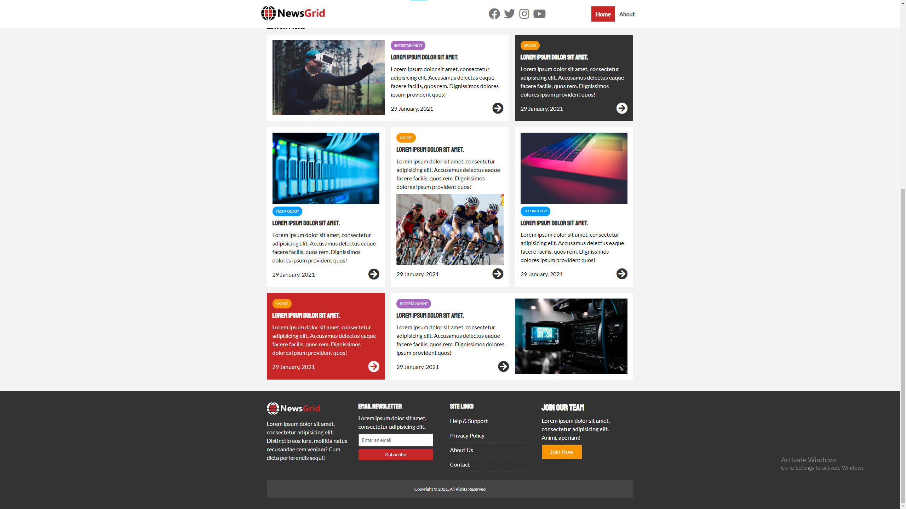
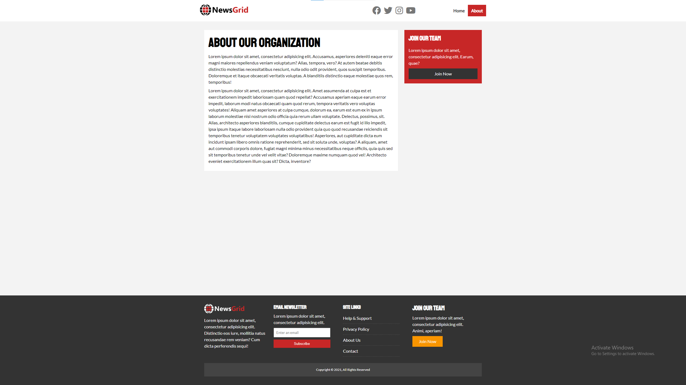
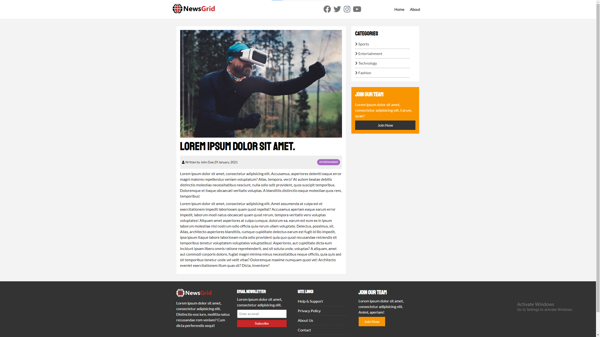

# NewsGrid Website
NewsGrid - project from the Udemy course but with a few new features (social links in the navbar and footer at the bottom of the page)

## Technologies:
- HTML
- CSS

## Link:
https://reznikov-newsgrid.netlify.app/

## Demo:

### Images

1 - Home Page[1]

2 - Home Page[2]

3 - About Page

4 - Article Page

